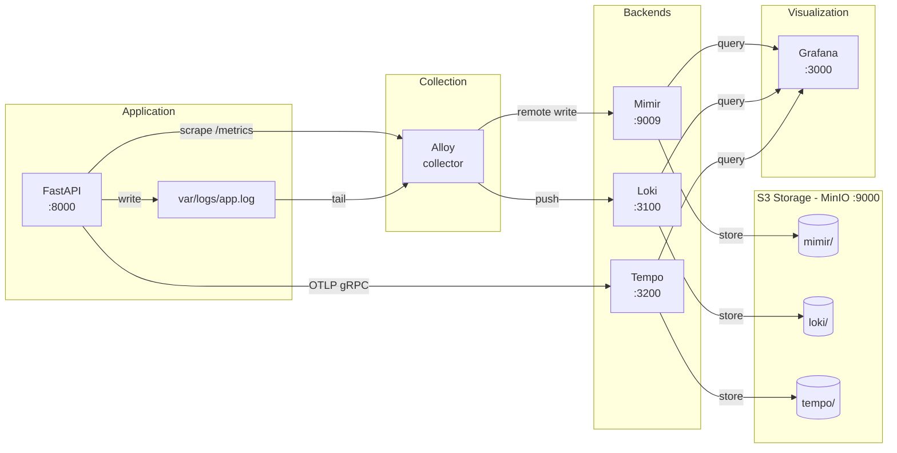

# Observability and Telemetry Demo

A demo project showcasing the three pillars of observability: **metrics**, **logs**, and **traces** — with S3-compatible storage.

## Architecture



## Services

| Service | Port | Description |
|---------|------|-------------|
| API | 8000 | FastAPI application |
| MinIO | 9000/9001 | S3-compatible storage (console: 9001) |
| Mimir | 9009 | Metrics database (replaces Prometheus) |
| Loki | 3100 | Log aggregation |
| Tempo | 3200 | Distributed tracing |
| Alloy | - | Metrics + log collector |
| Grafana | 3000 | Visualization |

### Service Descriptions

| Service | Reads From | Writes To | Description |
|---------|------------|-----------|-------------|
| **API** | - | `var/logs/app.log`, Tempo (OTLP) | FastAPI app instrumented with OpenTelemetry. Exposes `/metrics` endpoint. |
| **Alloy** | API `/metrics`, `var/logs/app.log` | Mimir, Loki | Telemetry collector. Scrapes metrics and tails logs, forwards to backends. |
| **Mimir** | Alloy (remote write) | MinIO `mimir/` bucket | Metrics database. Like Prometheus but with S3 storage and horizontal scaling. |
| **Loki** | Alloy (push) | MinIO `loki/` bucket | Log aggregation. Indexes by labels, stores in S3. "Prometheus for logs". |
| **Tempo** | API (OTLP traces) | MinIO `tempo/` bucket | Distributed tracing backend. Receives spans via OTLP, stores in S3. |
| **MinIO** | - | `./var/minio/` | S3-compatible storage. Replace with AWS S3 in production. |
| **Grafana** | Mimir, Loki, Tempo (APIs) | `./var/grafana/` | Visualization. Queries all backends, correlates via `trace_id`. |

## Quick Start

```bash
# Start all services
just up

# View logs
just logs

# Stop services
just down

# Clean all data
just clean
```

## Endpoints

| Service | URL | Credentials |
|---------|-----|-------------|
| API | http://localhost:8000 | - |
| MinIO Console | http://localhost:9001 | minioadmin / minioadmin |
| Grafana | http://localhost:3000 | admin / admin |

## S3 Storage

All telemetry data is stored in MinIO (S3-compatible):

| Bucket | Contains |
|--------|----------|
| `mimir` | Metrics (time series) |
| `loki` | Logs |
| `tempo` | Traces |

Access MinIO Console at http://localhost:9001 to browse buckets.

## Features

- **Metrics** → Alloy scrapes API → Mimir → S3
- **Logs** → Alloy tails files → Loki → S3
- **Traces** → API sends OTLP → Tempo → S3
- **Log ↔ Trace correlation** in Grafana via `trace_id`

## Log Rotation

The API uses Loguru with built-in log rotation to prevent `var/logs/app.log` from growing forever:

| Setting | Value | Description |
|---------|-------|-------------|
| `rotation` | 10 MB | Rotate when file reaches 10MB |
| `retention` | 7 days | Delete logs older than 7 days |
| `compression` | gz | Compress rotated files |

Rotated logs are stored as:
```
var/logs/
├── app.log                     # Current log (tailed by Alloy)
├── app.log.2024-12-17_12-00-00.gz  # Rotated + compressed
├── app.log.2024-12-16_12-00-00.gz
└── ...
```

> **Note:** Old logs are kept locally for 7 days as backup. The canonical log storage is in Loki (S3), which has its own retention policy.
