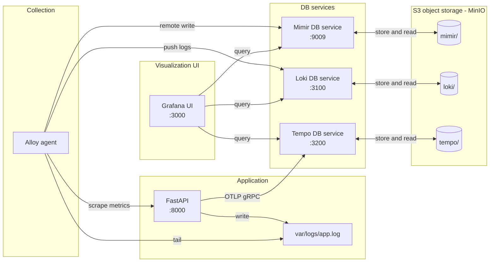
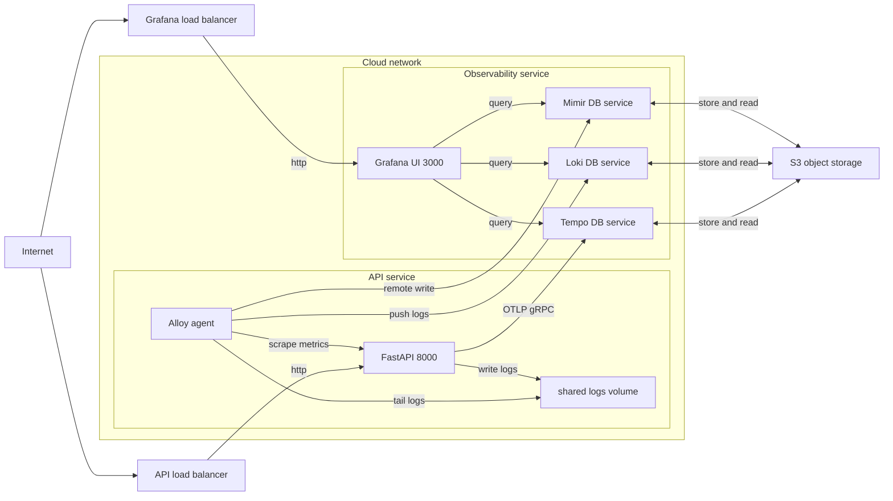

# Observability and Telemetry Demo

A demo project showcasing the three pillars of observability: **metrics**, **logs**, and **traces** — with S3-compatible storage.

## Architecture



## Cloud architecture (prototype)

Target: keep the **API isolated** as its own service, and run the **OSS observability backends** separately. In this repo’s implementation:
- **Alloy (sidecar)** collects **metrics + logs** from the API service and forwards them.
- **Traces** are exported **directly** from the API to Tempo (OTLP gRPC), as configured by `OTEL_EXPORTER_OTLP_ENDPOINT`.
- **S3** is the persistence layer (object storage). **Mimir/Loki/Tempo are DB services** (they run as services and read/write data to S3).



To run the prototype on a single host as two deployment units:

```bash
# Observability unit (Grafana + Mimir/Loki/Tempo + storage)
docker compose -f infra/docker-compose.obs.yml up -d

# API unit (API + Alloy sidecar agent)
docker compose -f infra/docker-compose.api.yml up -d
```

## Services

| Service | Port | Description |
|---------|------|-------------|
| API | 8000 | FastAPI application |
| MinIO | 9000/9001 | S3-compatible storage (console: 9001) |
| Mimir | 9009 | Prometheus-compatible metrics backend (remote_write + PromQL query API) |
| Loki | 3100 | Log aggregation |
| Tempo | 3200 | Distributed tracing |
| Alloy | - | Telemetry collector/agent (scrapes metrics, tails logs, forwards data) |
| Grafana | 3000 | Visualization |

### Service Descriptions

| Service | Reads From | Writes To | Goal | Description |
|---------|------------|-----------|------|-------------|
| **API** | - | `var/logs/app.log`, Tempo (OTLP gRPC) | Generate realistic app telemetry (metrics/logs/traces) with trace-aware structured logging. | FastAPI app with OpenTelemetry auto-instrumentation. Exposes Prometheus-format metrics at `/metrics` and exports traces via OTLP (`OTEL_EXPORTER_OTLP_ENDPOINT`). Logs are structured JSON and include `trace_id`/`span_id` for correlation. |
| **Alloy** | API `/metrics`, `var/logs/app.log` | Mimir (remote_write), Loki (push API) | Collect + transform telemetry at the edge and forward it to specialized backends (Prometheus-like scrape/ship). | Grafana Alloy collector (agent). In this stack it effectively replaces a standalone Prometheus: it **scrapes** `/metrics` and **remote_writes** to Mimir. It also tails local JSON logs, extracts labels/fields, and forwards them to Loki. (It is not a TSDB.) |
| **Mimir** | Alloy (Prometheus remote_write) | MinIO `mimir/` bucket | Store and query metrics at scale with Prometheus compatibility. | Prometheus-compatible metrics backend: ingests remote_write samples, serves PromQL queries to Grafana, and persists TSDB blocks/index to object storage (S3/MinIO). |
| **Loki** | Alloy (Loki push API) | MinIO `loki/` bucket | Centralize logs for search/aggregation and link them back to traces. | Log backend: ingests streams via `POST /loki/api/v1/push`, stores chunks/index in object storage, and serves LogQL queries. Labels (e.g. `service`, `level`, `method`) are derived by Alloy from the JSON logs. |
| **Tempo** | API (OTLP gRPC) | MinIO `tempo/` bucket | Store traces for end-to-end request debugging and correlation with logs/metrics. | Trace backend: receives spans via OTLP gRPC (`:4317`), stores WAL/blocks in object storage, and serves trace queries to Grafana. |
| **MinIO** | Mimir/Loki/Tempo (object-store reads) | `./var/minio/` | Provide durable object storage for backend persistence in local/dev. | S3-compatible object store used as the persistence layer for metrics/logs/traces (dev-only here). Swap to AWS S3/GCS/Azure Blob in production. |
| **Grafana** | Mimir/Loki/Tempo HTTP APIs | `./var/grafana/` | Explore, correlate, and visualize telemetry from a single UI. | UI + query engine: issues PromQL/LogQL/trace queries to the backends and links logs↔traces using the `trace_id` field (datasource provisioning sets derived fields). |

## Quick Start

```bash
# Start the stack (two units: observability + api)
just up

# View logs
just logs

# Stop services
just down

# Clean all data
just clean
```

## Endpoints

| Service | URL | Credentials |
|---------|-----|-------------|
| API | http://localhost:8000 | - |
| MinIO Console | http://localhost:9001 | minioadmin / minioadmin |
| Grafana | http://localhost:3000 | admin / admin |

## S3 Storage

All telemetry data is stored in MinIO (S3-compatible):

| Bucket | Contains |
|--------|----------|
| `mimir` | Metrics (time series) |
| `loki` | Logs |
| `tempo` | Traces |

Access MinIO Console at http://localhost:9001 to browse buckets.

## Features

- **Metrics** → Alloy scrapes API → Mimir → S3
- **Logs** → Alloy tails files → Loki → S3
- **Traces** → API sends OTLP → Tempo → S3
- **Log ↔ Trace correlation** in Grafana via `trace_id`

## Log Rotation

The API uses Loguru with built-in log rotation to prevent `var/logs/app.log` from growing forever:

| Setting | Value | Description |
|---------|-------|-------------|
| `rotation` | 10 MB | Rotate when file reaches 10MB |
| `retention` | 7 days | Delete logs older than 7 days |
| `compression` | gz | Compress rotated files |

Rotated logs are stored as:
```
var/logs/
├── app.log                     # Current log (tailed by Alloy)
├── app.log.2024-12-17_12-00-00.gz  # Rotated + compressed
├── app.log.2024-12-16_12-00-00.gz
└── ...
```

> **Note:** Old logs are kept locally for 7 days as backup. The canonical log storage is in Loki (S3), which has its own retention policy.
